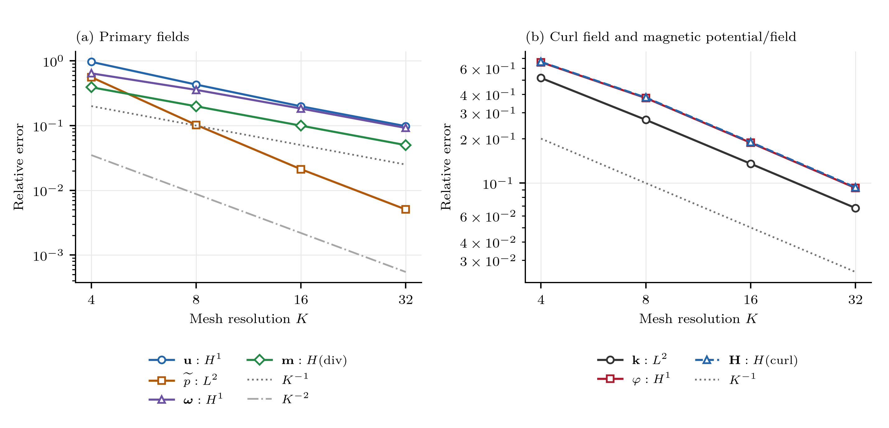
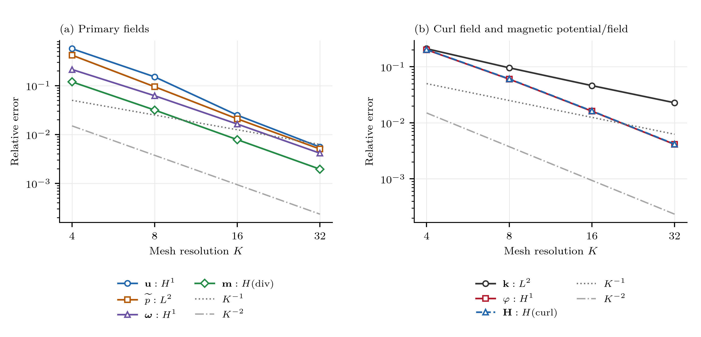
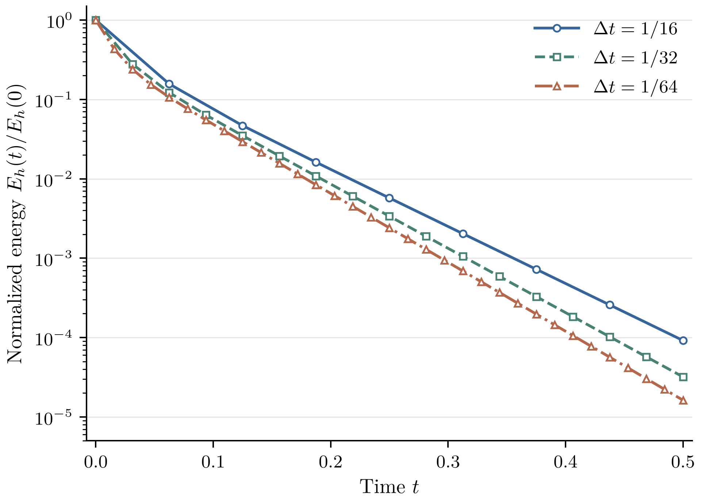
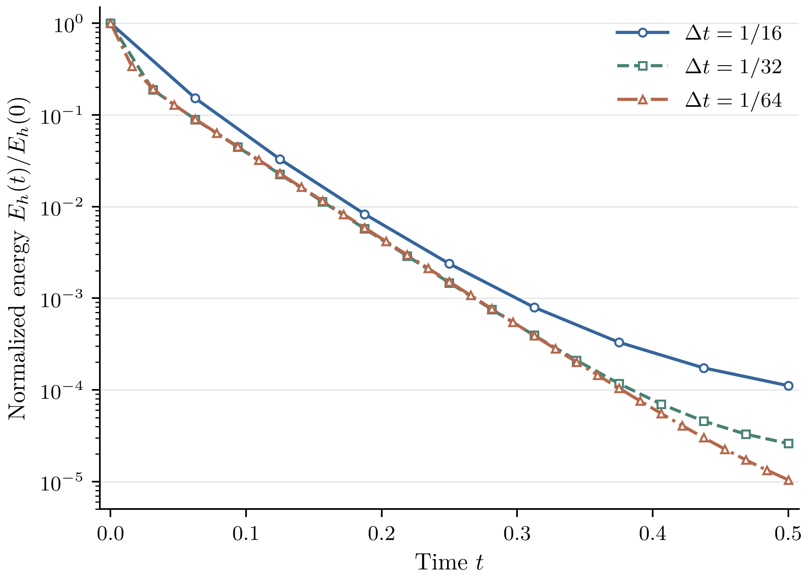

# FHD Algorithm 3 论文与数值实验

用于协作修订 Rosensweig 铁磁流体模型论文，包含论文 TeX、一阶/二阶数值实验、收敛图和对应数据。
仓库目前为公开；公开访问不等于授予开源许可证，本仓库尚未设置许可证。

## 目录

```text
main.tex                         论文主文件
experiments.tex                  可独立编译的数值实验预览
sections/
  first_order_experiments.tex     一阶实验与共同算例设置
  second_order_experiments.tex    二阶实验
  first_order_energy.tex          一阶零外场能量耗散实验
  second_order_energy.tex         二阶零外场能量耗散实验
figures/                         收敛图及两张独立能量图：PDF、SVG、PNG
data/
  results.csv                    8组主误差及42个观测收敛阶
  results.json                   同一数据的结构化版本
  provenance.json                数据与来源校验信息
  energy/                        六个能量算例的曲线、汇总和校验信息
scripts/
  figure_style.py                 所有插图共用的LaTeX字体与导出设置
  plot_convergence.py             由原始数据重画两张收敛图
  plot_energy.py                  由原始数据重画两张独立能量图
previews/
  manuscript.pdf                 完整论文编译预览
  numerical_experiments.pdf       仅数值实验的编译预览
Makefile                         本地编译命令
```

## 协作方式

- 修改实验文字、表格和图注：编辑 `sections/` 中对应文件。`main.tex` 通过 `\input` 引用它们，不应再复制一份有效正文。
- 修改理论推导：编辑 `main.tex`。**本次上传只整合了数值实验，之前讨论的理论公式修订没有在本轮同步。** 协作者需要在后续修订中保持理论稿与实验对象一致。
- 图片引用采用相对路径 `figures/`。PDF用于论文排版，SVG用于矢量编辑，PNG用于快速查看。
- 生成的 `.aux`、`.log` 等中间文件放在 `build/`，不提交。修改 TeX 后应重新编译；`previews/` 是已编译快照，不会自行更新。
- 正文原有的 `eq:H-dis-f-1` 重复标签警告仍保留，属于待处理的理论稿排版问题，不是本次数值实验片段产生的新标签。

## 编译

需要 TeX Live 或 MacTeX，以及 `latexmk`。从仓库根目录执行：

```bash
make pdf
```

输出为 `build/main.pdf`。`make experiments` 生成独立的数值实验预览。
检查排版后运行 `make preview` 可更新 `previews/` 中两份 PDF。
安装 Python 的 `matplotlib` 和 `numpy`，并将 TeX Live/MacTeX 的 `latex`、`dvipng` 加入 PATH 后，
运行 `make figures` 可重新生成论文中全部四张图；TeX 环境需包含 `lmodern` 字体包和 `amsmath`。
此命令只从归档数据重绘，不重跑数值求解，也不改变误差、能量或参考线数据。
所有图的普通文字、数学符号、刻度和图例均使用真正的LaTeX渲染及Latin Modern字体。
PDF嵌入字体；SVG使用TeX字形的矢量路径，修改文本应编辑绘图脚本并重绘。
也可以将整个仓库上传到 Overleaf，以 `main.tex` 为主文件并使用 pdfLaTeX 编译。

## 收敛实验口径

- 三维单位立方体；同一 `balanced-linear-weak-coupling` 制造解。
- 一阶、二阶均有 K=4、8、16、32，T=2，dt=1/K，终点数据均已完成计算。
- 横轴为从左到右增加的 K=4、8、16、32，参考线为 K^{-1} 和 K^{-2}。
- 主指标：u完整H1、修正压力L2、omega完整H1、m-H(div)、k-L2、phi-H1、H-H(curl)，另报curl(H)的采样绝对最大值。
- 二阶压力参考为精确修正压力的端点平均；修正压力为去均值的 p-mu0*m.H/2。
- 二阶k-L2仍约一阶，未声称所有变量二阶收敛。dt与网格同时变化，结果不是独立的纯时间精度验证。
- 此组收敛数据本身不用于验证能量稳定性；尚未加入纯时间二阶试验或性能加速结论。





## 能量耗散实验

- 零外场、零源项、齐次边界；单位立方体K=8，T=0.5。
- 一阶、二阶各测试dt=1/16、1/32、1/64，使用48 MPI进程、每进程1线程。
- 非零初值取上述平滑场的空间形状，重新满足零外场约束；不延续制造解时间函数。
- 每步积分原生有限元场的能量，并核对包含耗散项的离散平衡。
- 六条曲线均单调衰减；最大归一化平衡缺口为3.71e-11。
- 两种格式分别使用其生产有限元空间，不能将两图当作同空间的纯时间精度比较。
- 一阶、二阶分别成图，纵轴为E(t)/E(0)的对数刻度；数据不平滑、不拟合。
- 两张能量图与收敛图共用LaTeX字体设置，使用与正文一致的Latin Modern字体。





本仓库仅含论文协作材料，不包含SSH密钥、服务器登录资料、计算日志或完整有限元求解器。
