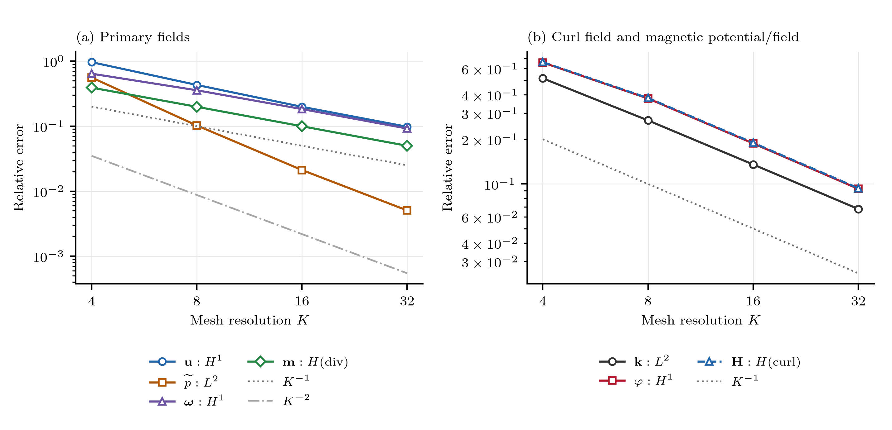
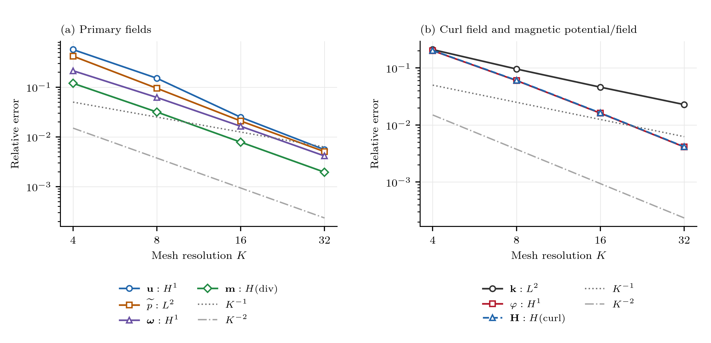
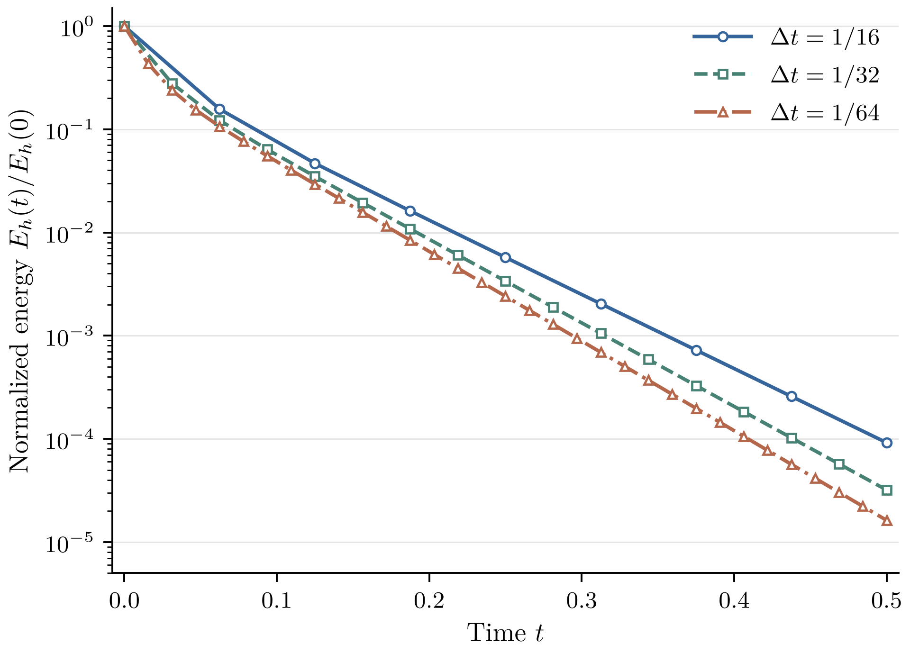
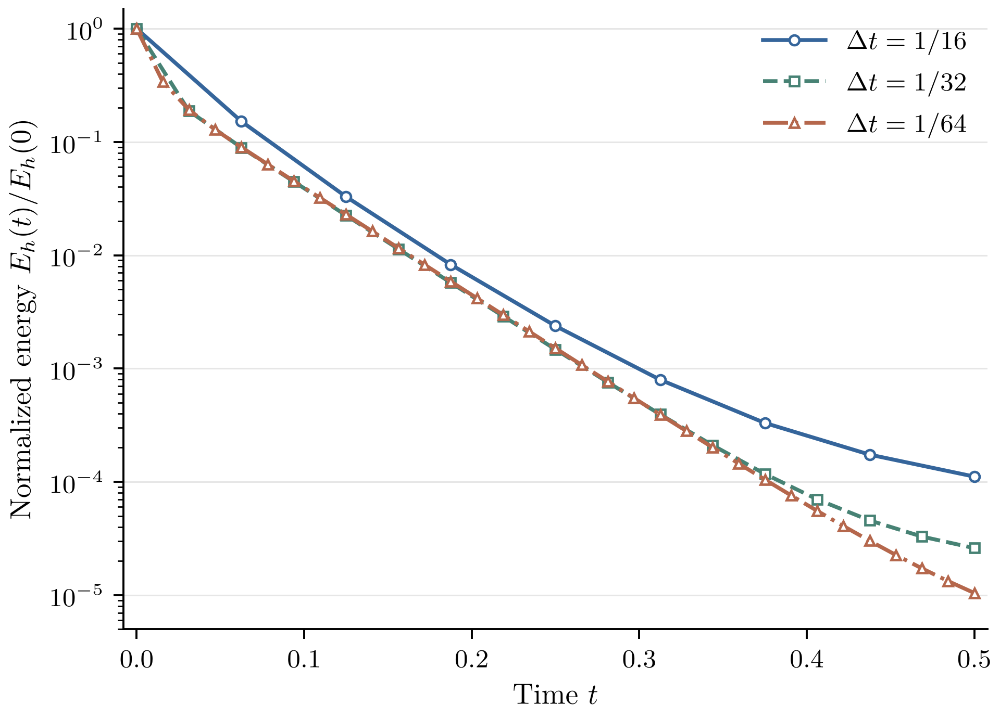

# FHD Algorithm 3 论文与数值实验

用于协作修订 Rosensweig 铁磁流体模型论文，包含论文 TeX、一阶/二阶数值实验、通道与台阶流应用、插图和对应数据。
仓库目前为公开；公开访问不等于授予开源许可证，本仓库尚未设置许可证。

## 目录

```text
main.tex                         论文主文件
experiments.tex                  可独立编译的数值实验预览
sections/
  numerical_experiments.tex       文末第6节数值实验总入口
  experiment_setup.tex            统一算例、离散设置及误差指标
  first_order_experiments.tex     一阶收敛结果
  second_order_experiments.tex    二阶收敛结果
  energy_setup.tex                统一零外场算例、能量与平衡指标
  first_order_energy.tex          一阶能量耗散结果
  second_order_energy.tex         二阶能量耗散结果
  channel_flow.tex                直通道流：条件、开放边界、验证与结果
  step_flow.tex                   后向台阶流：条件与三场可视化
figures/                         收敛图及两张独立能量图：PDF、SVG、PNG
  applications/                  六张应用插图：PDF、PNG及校验信息
data/
  results.csv                    8组主误差及42个观测收敛阶
  results.json                   同一数据的结构化版本
  provenance.json                数据与来源校验信息
  energy/                        六个能量算例的曲线、汇总和校验信息
  applications/                  两个原始采样快照、参数、来源和验证摘要
scripts/
  figure_style.py                 收敛与能量图的LaTeX字体及导出设置
  plot_convergence.py             由原始数据重画两张收敛图
  plot_energy.py                  由原始数据重画两张独立能量图
  plot_applications.py            由归档快照重画六张应用插图
previews/
  manuscript.pdf                 完整论文编译预览
  numerical_experiments.pdf       仅数值实验的编译预览
Makefile                         本地编译命令
REVISION_CN.md                   本轮修订范围、编译检查和结果使用边界
```

## 协作方式

- 数值实验统一位于一阶、二阶理论章节之后、参考文献之前的第6节：6.1实验设置、6.2收敛性验证、6.3能量耗散、6.4直通道流、6.5后向台阶流。
- 两种格式分别成图，但同类结果连续排列，不再穿插于理论章节之间。
- 修改实验文字、表格和图注：编辑 `sections/` 中对应文件。`main.tex` 和 `experiments.tex` 共用 `numerical_experiments.tex` 入口，不应再复制一份有效正文。
- 修改理论推导：编辑 `main.tex`。本轮新增应用章节，并同步摘要和文章结构说明；此前理论公式的整体修订不在本轮范围内。应用章节明确列出开放边界扩展，没有将齐次边界下的理论结论直接推广到开放台阶区域。
- 图片引用采用相对路径 `figures/`。PDF用于论文排版，SVG用于矢量编辑，PNG用于快速查看。
- 生成的 `.aux`、`.log` 等中间文件放在 `build/`，不提交。修改 TeX 后应重新编译；`previews/` 是已编译快照，不会自行更新。
- 原有第二处 `eq:H-dis-f-1` 已更名为 `eq:H-dis-f-2`，消除重复标签；对应数学公式保持原样。

## 编译

需要 TeX Live 或 MacTeX，以及 `latexmk`。从仓库根目录执行：

```bash
make pdf
```

输出为 `build/main.pdf`。`make experiments` 生成独立的数值实验预览。
检查排版后运行 `make preview` 可更新 `previews/` 中两份 PDF。
安装 Python 的 `matplotlib` 和 `numpy`，并将 TeX Live/MacTeX 的 `latex`、`dvipng` 加入 PATH 后，
运行 `make figures` 可重新生成四张收敛和能量图；TeX 环境需包含 `lmodern` 字体包和 `amsmath`。
此命令只从归档数据重绘，不重跑数值求解，也不改变误差、能量或参考线数据。
所有图的普通文字、数学符号、刻度和图例均使用真正的LaTeX渲染及Latin Modern字体。
PDF嵌入字体；SVG使用TeX字形的矢量路径，修改文本应编辑绘图脚本并重绘。
也可以将整个仓库上传到 Overleaf，以 `main.tex` 为主文件并使用 pdfLaTeX 编译。

六张通道与台阶流图需要额外的 Python 包 `scipy`，用以下命令重绘：

```bash
make application-figures PYTHON=python3 TEX_ENGINE=/path/to/pdflatex
```

该脚本也支持 `TEX_ENGINE=/path/to/tectonic`；它先校验归档 NPZ 的 SHA-256，
再绘制矢量与模值图，最后使用 LaTeX/TikZ 排印色条。
图号、标题和条件由论文图注排版，图片内没有重复标题或技术小字。
若 PATH 中有 `pdftoppm`，会同时导出 PNG。该步骤只重绘已有数据，不运行有限元求解器。

本轮 PDF 使用 [Tectonic](https://tectonic-typesetting.github.io/) 0.17.0 编译。
安装该程序后，也可直接执行：

```bash
mkdir -p build
tectonic --keep-logs --outdir build main.tex
tectonic --keep-logs --outdir build experiments.tex
cp build/main.pdf previews/manuscript.pdf
cp build/experiments.pdf previews/numerical_experiments.pdf
```

## 收敛实验口径

- 三维单位立方体；同一 `balanced-linear-weak-coupling` 制造解。
- 一阶、二阶均有 K=4、8、16、32，T=2，dt=1/K，终点数据均已完成计算。
- 横轴为从左到右增加的 K=4、8、16、32，参考线为 K^{-1} 和 K^{-2}。
- 主指标：u完整H1、修正压力L2、omega完整H1、m-H(div)、k-L2、phi-H1、H-H(curl)，另报curl(H)的采样绝对最大值。
- 二阶压力参考为精确修正压力的端点平均；修正压力为去均值的 p-mu0*m.H/2。
- 二阶k-L2仍约一阶，未声称所有变量二阶收敛。dt与网格同时变化，结果不是独立的纯时间精度验证。
- 此组收敛数据本身不用于验证能量稳定性；尚未加入纯时间二阶试验或性能加速结论。





## 能量耗散实验

- 零外场、零源项、齐次边界；单位立方体K=8，T=0.5。
- 一阶、二阶各测试dt=1/16、1/32、1/64，使用48 MPI进程、每进程1线程。
- 非零初值取上述平滑场的空间形状，重新满足零外场约束；不延续制造解时间函数。
- 每步积分原生有限元场的能量，并核对包含耗散项的离散平衡。
- 六条曲线均单调衰减；最大归一化平衡缺口为3.71e-11。
- 两种格式分别使用其生产有限元空间，不能将两图当作同空间的纯时间精度比较。
- 一阶、二阶分别成图，纵轴为E(t)/E(0)的对数刻度；数据不平滑、不拟合。
- 两张能量图与收敛图共用LaTeX字体设置，使用与正文一致的Latin Modern字体。





本仓库仅含论文协作材料，不包含SSH密钥、服务器登录资料、计算日志或完整有限元求解器。

## 通道与后向台阶流应用

- 两例采用二阶格式和五块 Algorithm 3；初值为零，入口平滑启动，外置偶极子的幅值随时间变化。
- 第6.4节给出材料参数、入口函数、磁源位置和波形、物理压力与修正压力关系、开放边界及辅助变量条件。
- 直通道展示 K12、t=2 的速度、磁化、颗粒角速度；同时报告原生体积 L2 相邻网格差异及无磁场对照。
- 台阶流展示已指定的真实保存时刻 t=0.715，K4、dt=0.005；三种场使用同一时间层。当前图片用于定性展示，不能替代台阶流的最终网格无关性验证。
- 每图左侧为稀疏矢量，右侧为模值截面。直通道截面为 z=0.1；台阶流截面为 y=0.1。箭长与模值线性关联，没有时间插值或数据重造。
- 两例均有给定入口速度，本文没有据此声称从静止流体实现纯磁驱动泵送或获得净流量增益。
- 快照、源码哈希、验证摘要及重绘说明位于 `data/applications/`。
